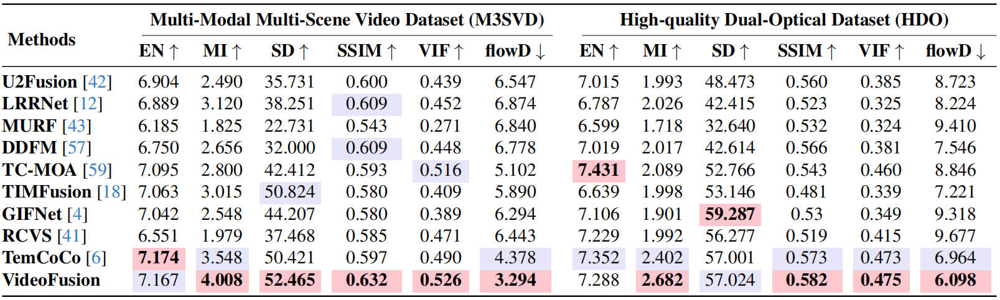
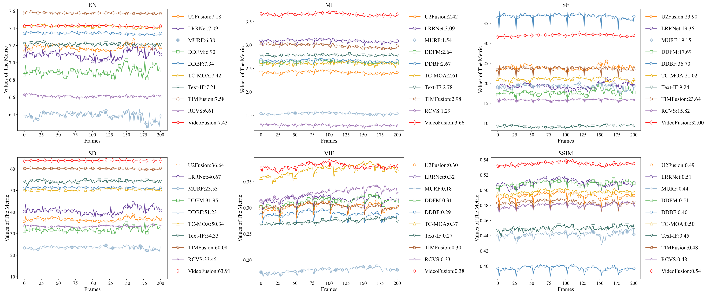

<div align="center">

<h1>VideoFusion: A Spatio-Temporal Collaborative Network for Multi-modal Video Fusion and Restoration (CVPR 2026)</h1>

<p>
<b>Official PyTorch implementation</b> of <i>"VideoFusion: A Spatio-Temporal Collaborative Network for Multi-modal Video Fusion and Restoration"</i>
</p>

<p>
<a href="(Paper link)"></a>
<a href="(arXiv link)"></a>
<a href="(Project page)"></a>
<a href="(Dataset link)"></a>
</p>

<p>
Linfeng Tang, Yeda Wang, Meiqi Gong, Zizhuo Li, Yuxin Deng, Xunpeng Yi, Chunyu Li, Hao Zhang, Han Xu, Jiayi Ma
</p>

</div>

---

## 🔥 News
- **[2026]** VideoFusion has been **accepted to CVPR 2026**.
- **[2025]** We release **M3SVD**, a large-scale aligned **infrared-visible multi-modal video dataset** for fusion & restoration.
- Pretrained weights / dataset links / scripts will be updated here.
---

## 🔎 Motivation
Most multi-modal fusion methods are designed for **static images**. Applying them frame-by-frame to videos often leads to:
- **Temporal flickering** (inconsistent fusion across frames)
- Under-utilization of **motion/temporal cues**
- Poor robustness under **real-world degradations**

VideoFusion explicitly models **cross-modal complementarity + temporal dynamics**, and supports **multi-modal video fusion & restoration** in a unified framework.

<p align="center">
  
</p>

---

## ✨ Key Contributions
- **VideoFusion**: a spatio-temporal collaborative network for **multi-modal video fusion and restoration**.
- **Spatio-temporal collaboration**
- **Temporal stabilization** via **variation-level consistency constraint** to reduce flicker.
- **M3SVD dataset**: a large-scale synchronized & registered IR-VI video benchmark.
---

## 🧠 Architecture
<p align="center">
  
</p>

---

## 📦 M3SVD Dataset
- **220** temporally synchronized & spatially registered IR-VI videos  
- **153,797** frames total  
- Registered resolution **640×480**, **30 FPS**  
- Diverse conditions: **daytime / nighttime / challenging scenarios** (e.g., occlusion, disguise, low illumination, overexposure)

<p align="center">
  
</p>

### Dataset Comparison (vs. prior works)
<p align="center">
  
</p>

### Data Processing Workflow
<p align="center">
  
</p>

> 📌 Place dataset files following the dataloader requirement (see **Dataset Preparation** section).  
> 🔗 Download links will be updated: **(TBD)**

---
## ⚙️ Installation

### 1) Clone
```bash
git clone git@github.com:Linfeng-Tang/VideoFusion.git
cd VideoFusion
```

### 2) Create Environment
```bash id="xzet4o"
conda create -n videofusion python=3.9 -y
conda activate videofusion
pip install -r requirements.txt
```
---

## 🚀 Quick Start (Testing)

### Prepare
1. Download pretrained weights: **(TBD)**
2. Put weights into:
```text
./pretrained_weights/
```

### Run
```bash id="hs2gsx"
python test.py -opt=./options/test/test_VideoFusion.yml
```
---

## 🚂 Training

### 1) Dataset Preparation
Download **M3SVD** and place it as:
```text
<your_m3svd_root>/
  ├── train/
  │   ├── ir/seqxxx/*.png
  │   └── vi/seqxxx/*.png
  ├── val/
  │   ├── ir/...
  │   └── vi/...
  └── test/
      ├── ir/...
      └── vi/...
```

Then update `options/train/train_VideoFusion.yml` with the correct dataset root paths.

### 2) DDP Training
```bash id="7p52sw"
CUDA_VISIBLE_DEVICES=0,1,2,3 torchrun --nproc_per_node=4 --master_port=7542 \
  train.py -opt ./options/train/train_VideoFusion.yml --launcher pytorch
```
---

## 🖼️ Qualitative Results

### Fusion Quality (examples)
<p align="center">
  
</p>
<p align="center">
  
</p>
<p align="center">
  <i>
    Quantitative comparison on the M3SVD and HDO datasets under degraded scenarios. 
    Each video in M3SVD and HDO contains 200 and 150 frames, respectively. 
    The best and second-best results are highlighted in Red and Purple, respectively.
  </i>
</p>

### Restoration / Robustness under Degradations
<p align="center">
  
</p>

## ⏱️ Temporal Consistency

VideoFusion emphasizes temporal coherence. We provide temporal visualization examples:
<p align="center">
  
</p>
<p align="center">
  <i>
    Temporal variation of metrics on sequences.
  </i>
</p>

<p align="center">
  
</p>
<p align="center">
  <i>
    Visual comparison of temporal consistency in source and  fusion videos. Following DSTNet, we visualize pixels along selected  columns (dotted line) and measure average brightness variation  across frames.
  </i>
</p
---

## 📈 Ablation & Analysis

### Ablation Study
<p align="center">
  
</p>

---

## 🎯 Downstream / Tracking Demo
<p align="center">
  
</p>

---

## 📝 Citation
If you find this work useful, please cite:

```bibtex id="otv94e"
@inproceedings{Tang2026VideoFusion,
  title     = {VideoFusion: A Spatio-Temporal Collaborative Network for Multi-modal Video Fusion and Restoration},
  author    = {Tang, Linfeng and Wang, Yeda and Gong, Meiqi and Li, Zizhuo and Deng, Yuxin and Yi, Xunpeng and Li, Chunyu and Zhang, Hao and Xu, Han and Ma, Jiayi},
  booktitle = {Proceedings of the IEEE/CVF Conference on Computer Vision and Pattern Recognition (CVPR)},
  year      = {2026}
}
```

---

## 🤝 Contact
If you have any questions, please do not hesitate to contact **linfeng0419@gmail.com**.

---
