<div align="center">

<h1>VideoFusion: A Spatio-Temporal Collaborative Network for Multi-modal Video Fusion and Restoration (CVPR 2026)</h1>

<p>
<b>Official PyTorch implementation</b> of <i>"VideoFusion: A Spatio-Temporal Collaborative Network for Multi-modal Video Fusion and Restoration"</i>
</p>

<p>
<a href="(Paper link)"></a>
<a href="(arXiv link)"></a>
<a href="(Project page)"></a>
<a href="(Dataset link)"></a>
</p>

<p>
Linfeng Tang, Yeda Wang, Meiqi Gong, Zizhuo Li, Yuxin Deng, Xunpeng Yi, Chunyu Li, Hao Zhang, Han Xu, Jiayi Ma
</p>

</div>

---

## 🔥 News
- **[2026]** VideoFusion has been **accepted to CVPR 2026**.
- **[2025]** We release **M3SVD**, a large-scale aligned **infrared-visible multi-modal video dataset** for fusion & restoration.
- Pretrained weights / dataset links / scripts will be updated here.
---

## 🔎 Overview

### Motivation
Most multi-modal fusion methods are designed for **static images**. Applying them frame-by-frame to videos often leads to:
- **Temporal flickering** (inconsistent fusion across frames)
- Under-utilization of **motion/temporal cues**
- Poor robustness under **real-world degradations**

VideoFusion explicitly models **cross-modal complementarity + temporal dynamics**, and supports **multi-modal video fusion & restoration** in a unified framework.

<p align="center">
  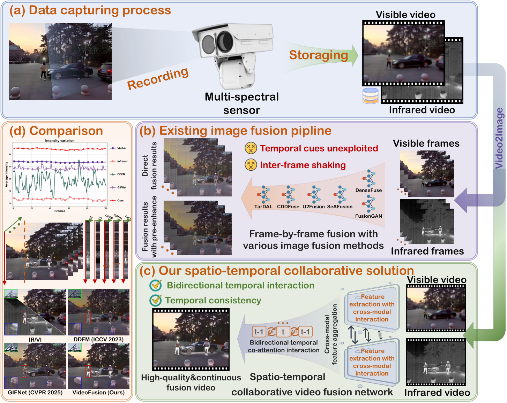
</p>

---

## ✨ Key Contributions
- **VideoFusion**: a spatio-temporal collaborative network for **multi-modal video fusion and restoration**.
- **Spatio-temporal collaboration**
- **Temporal stabilization** via **variation-level consistency constraint** to reduce flicker.
- **M3SVD dataset**: a large-scale synchronized & registered IR-VI video benchmark.
---

## 🧠 Method at a Glance

### Architecture
Core modules:
1. **CmDRM**: Cross-modal Differential Reinforcement Module  
2. **CMGF**: Complete Modality-guided Fusion  
3. **BiCAM**: Bi-temporal Co-attention Module  
4. **Transformer-based enhancement** (Restormer-style operator)
5. **Modality Unmixing** + IR/VI decoders

<p align="center">
  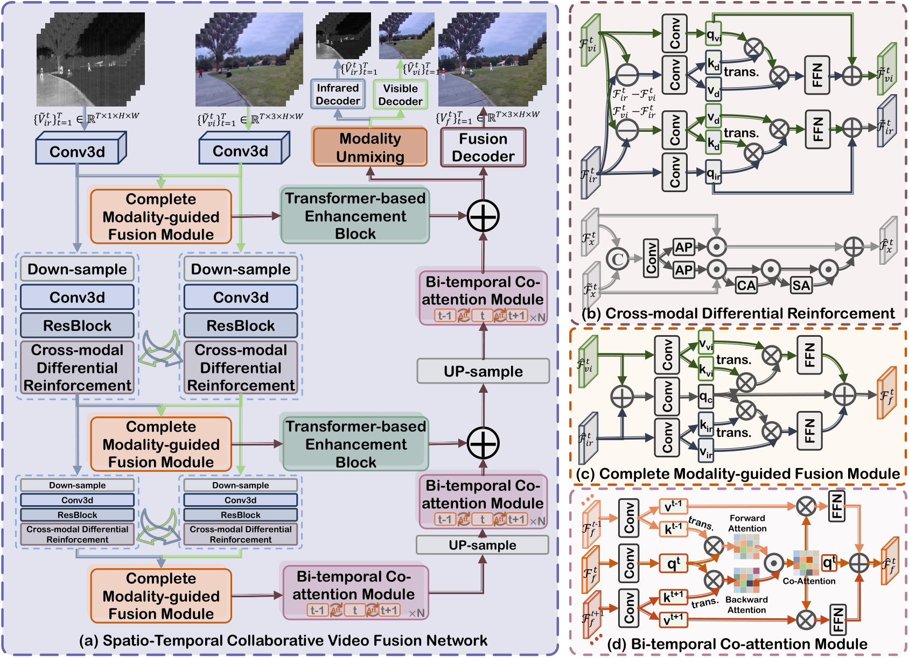
</p>

---

## 📦 M3SVD Dataset

### Scale & Properties
- **220** temporally synchronized & spatially registered IR-VI videos  
- **153,797** frames total  
- Registered resolution **640×480**, **30 FPS**  
- Diverse conditions: **daytime / nighttime / challenging scenarios** (e.g., occlusion, disguise, low illumination, overexposure)

<p align="center">
  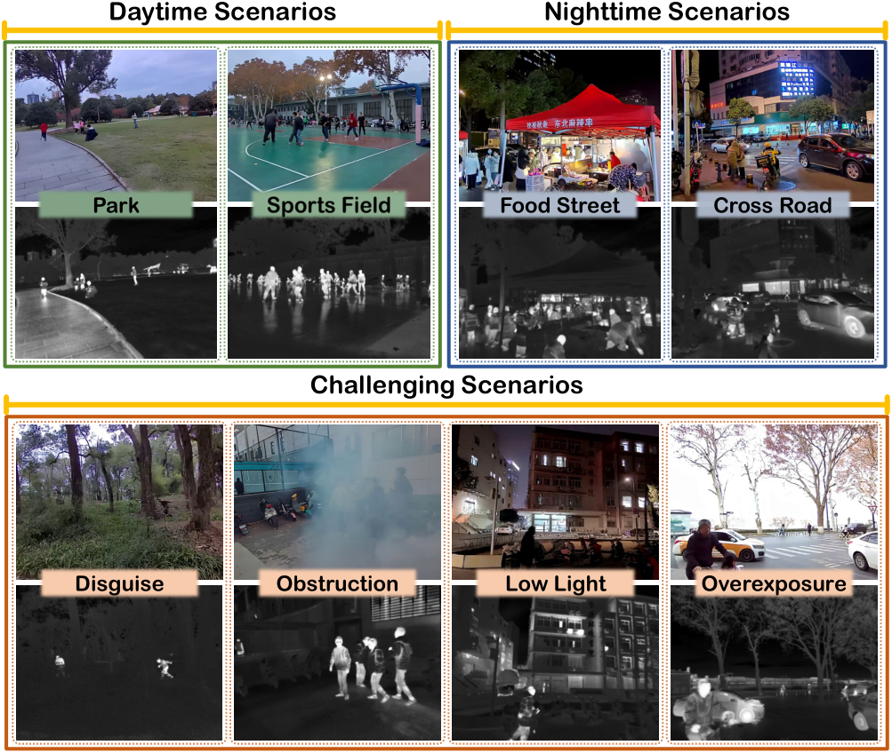
</p>

### Dataset Comparison (vs. prior works)
<p align="center">
  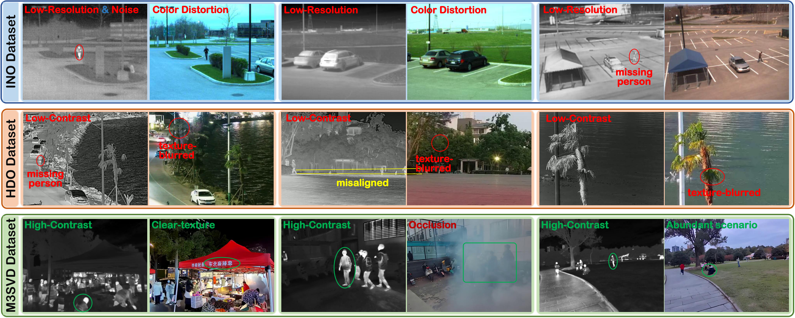
</p>

### Acquisition & Registration (Brief)
- Synchronized dual-spectral capture (IR + Visible)
- Distortion calibration (both sensors)
- Estimate robust multimodal correspondences and compute homography for spatial registration

<p align="center">
  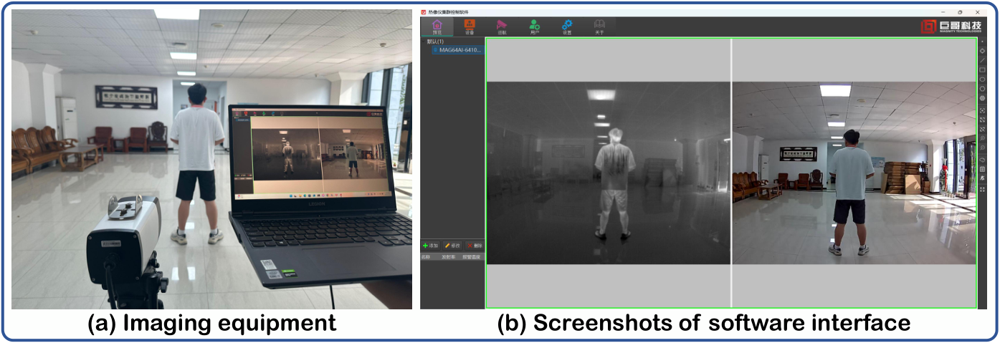
</p>

> 📌 Place dataset files following the dataloader requirement (see **Dataset Preparation** section).  
> 🔗 Download links will be updated: **(TBD)**

---

## 🖼️ Qualitative Results

### Fusion Quality (examples)
<p align="center">
  
</p>

### Restoration / Robustness under Degradations
<p align="center">
  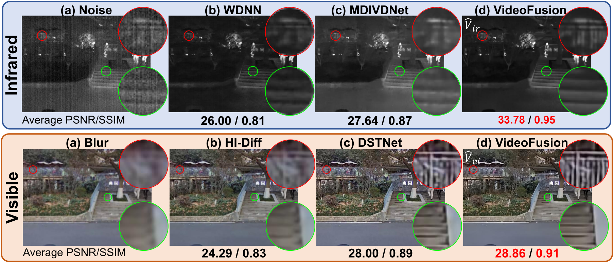
</p>

### Challenging Scenarios
<p align="center">
  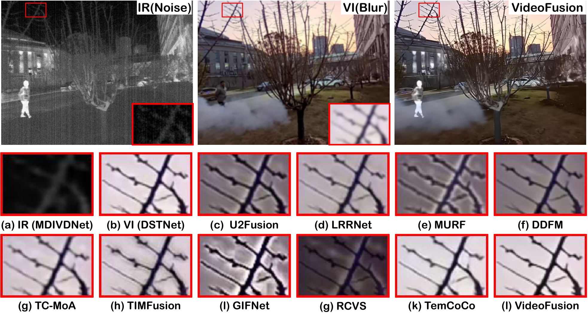
</p>

---

## ⏱️ Temporal Consistency

VideoFusion emphasizes temporal coherence. We provide temporal visualization examples:

<p align="center">
  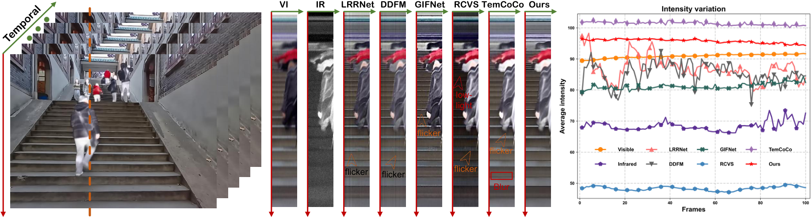
</p>

<p align="center">
  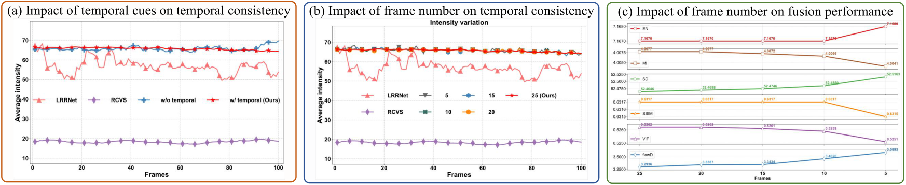
</p>

---

## 📈 Ablation & Analysis

### Ablation Study
<p align="center">
  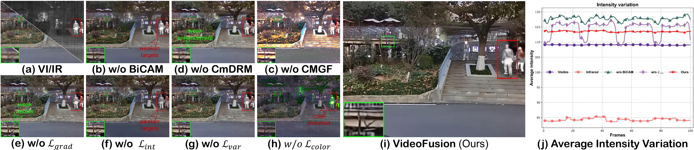
</p>

### Loss Curves
<p align="center">
  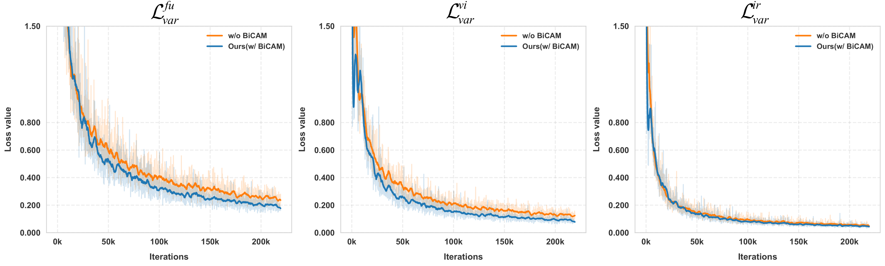
</p>

### Radar Charts (metric summary)
<p align="center">
  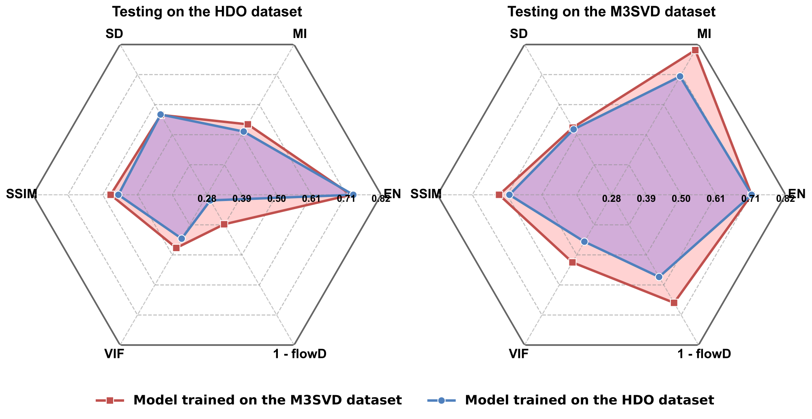
  
</p>

---

## 🎯 Downstream / Tracking Demo (Optional)
<p align="center">
  
</p>

---

## 🧩 Pipeline / Workflow
<p align="center">
  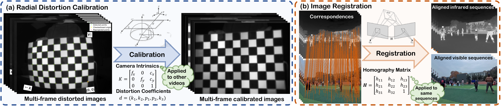
</p>

---

## ⚙️ Installation

### 1) Clone
```bash
git clone (your_repo_url_here)
cd VideoFusion
```

### 2) Create Environment
```bash id="xzet4o"
conda create -n videofusion python=3.9 -y
conda activate videofusion
pip install -r requirements.txt
```

> If you use CUDA, please make sure your PyTorch / torchvision versions match your CUDA driver.

---

## 🚀 Quick Start (Testing)

### Prepare
1. Download pretrained weights: **(TBD)**
2. Put weights into:
```text
./pretrained_weights/
```

### Run
```bash id="hs2gsx"
python test.py -opt=./options/test/test_VideoFusion.yml
```

### Outputs
Fused videos and/or restored outputs will be saved to the directory specified in the test YAML.

---

## 🧪 Inference on Your Own Data

### Expected folder format
Organize infrared-visible sequences as:
```text
<your_data_root>/
  ├── ir/
  │   ├── seq001/
  │   │   ├── 000000.png
  │   │   ├── 000001.png
  │   │   └── ...
  │   └── ...
  └── vi/
      ├── seq001/
      │   ├── 000000.png
      │   ├── 000001.png
      │   └── ...
      └── ...
```

> Notes:
> - Make sure IR/VI frames are **time-synchronized** and **spatially registered**.
> - Visible frames should be **RGB** (3-channel). IR can be 1-channel or converted to expected format by the loader.

### Run inference
1) Modify `options/test/test_VideoFusion.yml`:
- `dataroot_ir`, `dataroot_vi`
- output directory
- clip length / stride (if enabled)
- GPU ids

2) Run:
```bash id="j9108l"
python test.py -opt=./options/test/test_VideoFusion.yml
```

> In our paper, testing may use a larger temporal window (e.g., **T=25**) to exploit more temporal context (adjust according to GPU memory).

---

## 🚂 Training

### 1) Dataset Preparation
Download **M3SVD** and place it as:
```text
<your_m3svd_root>/
  ├── train/
  │   ├── ir/seqxxx/*.png
  │   └── vi/seqxxx/*.png
  ├── val/
  │   ├── ir/...
  │   └── vi/...
  └── test/
      ├── ir/...
      └── vi/...
```

Then update `options/train/train_VideoFusion.yml` with the correct dataset root paths.

### 2) DDP Training
```bash id="7p52sw"
CUDA_VISIBLE_DEVICES=0,1,2,3 torchrun --nproc_per_node=4 --master_port=7542 \
  train.py -opt ./options/train/train_VideoFusion.yml --launcher pytorch
```

### 3) Training Tips (Recommended)
- Use smaller temporal window during training to fit memory (e.g., **T=7**)
- Use mixed precision if supported
- Validate periodically and keep best checkpoint

---

## 📊 Evaluation

### Metrics
We report both fusion quality and temporal consistency (depending on code/config):
- Fusion quality: EN / MI / SD / SSIM / VIF / etc.
- Temporal coherence: flow-based or variation-based measures (e.g., **flowD**)

### Run evaluation (example)
```bash id="12e2bm"
python eval.py -opt=./options/test/test_VideoFusion.yml
```

> If `eval.py` is not provided, please evaluate using your preferred scripts or integrate evaluation following the configs.

---

## 🗂️ Project Structure
```text
VideoFusion/
  ├── options/
  │   ├── train/
  │   │   └── train_VideoFusion.yml
  │   └── test/
  │       └── test_VideoFusion.yml
  ├── pretrained_weights/
  ├── train.py
  ├── test.py
  ├── models/
  ├── data/
  ├── utils/
  ├── requirements.txt
  ├── assets/
  │   ├── Motivation.jpg
  │   ├── Framework.jpg
  │   ├── Datasets.jpg
  │   ├── Dataset_Comparison.jpg
  │   ├── Qualitative.jpg
  │   ├── Restoration.jpg
  │   ├── Challenging.jpg
  │   ├── Temporal.jpg
  │   ├── Frames.jpg
  │   ├── Ablation.jpg
  │   ├── loss.jpg
  │   ├── Radar.jpg
  │   ├── Radar_zoom.jpg
  │   ├── Track.jpg
  │   ├── Workflow.jpg
  │   ├── Device.jpg
  │   └── MATLAB.png
  └── README.md
```

---

## 📝 Citation
If you find this work useful, please cite:

```bibtex id="otv94e"
@inproceedings{Tang2026VideoFusion,
  title     = {VideoFusion: A Spatio-Temporal Collaborative Network for Multi-modal Video Fusion and Restoration},
  author    = {Tang, Linfeng and Wang, Yeda and Gong, Meiqi and Li, Zizhuo and Deng, Yuxin and Yi, Xunpeng and Li, Chunyu and Zhang, Hao and Xu, Han and Ma, Jiayi},
  booktitle = {Proceedings of the IEEE/CVF Conference on Computer Vision and Pattern Recognition (CVPR)},
  year      = {2026}
}
```

---

## 🤝 Contact
- linfeng0419@gmail.com  
- licy0089@gmail.com  

---

## ❤️ Acknowledgments
This repo is implemented in **PyTorch**.  
We thank related open-source projects and the community for inspiring ideas and tools.

---

## 📌 Notes
- Links (paper/arXiv/dataset/weights) are marked **TBD** and will be updated.
- If you encounter issues about environment setup / dataloader formats / evaluation scripts, please open an issue with logs and your config file.
